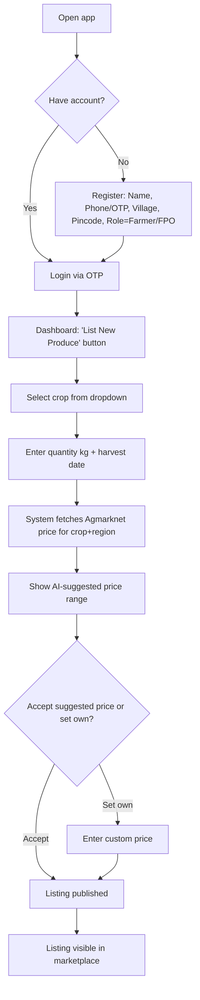
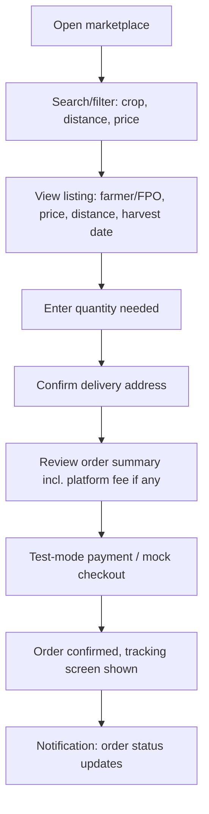
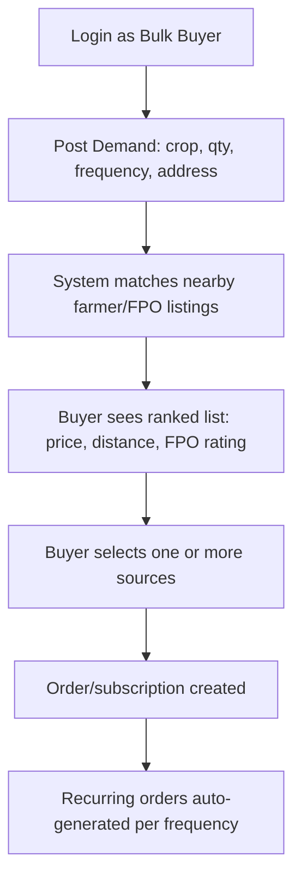
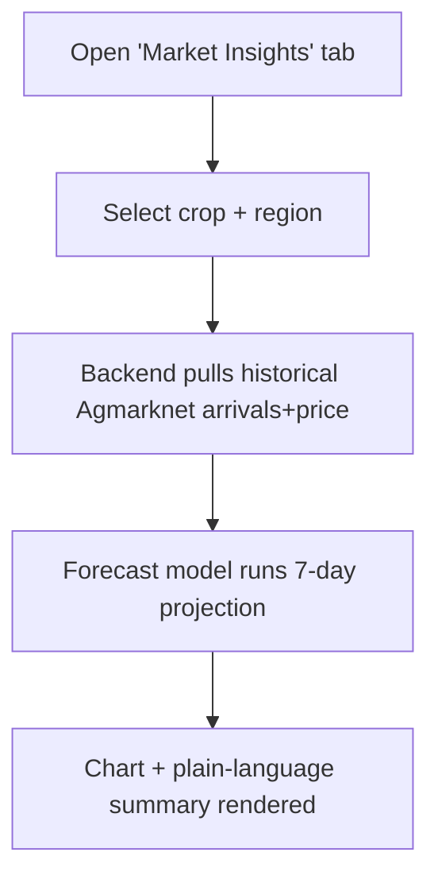
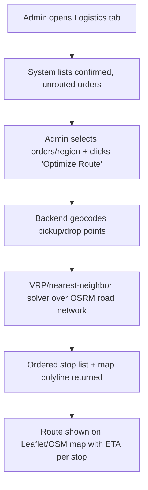
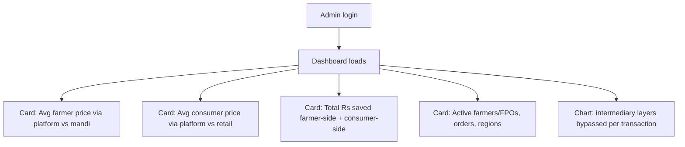

# 02 — User Personas & User Flows

## 1. Personas

### Persona A — Ramesh (Farmer)
- 42, grows tomatoes & onions on 3 acres near Rewari, Haryana.
- Owns a basic Android phone, uses WhatsApp daily, moderate Hindi literacy, low English.
- Pain: sells to village trader at whatever price offered, no idea what mandi rate actually is that day.
- Goal: sell at a fair, transparent price without traveling to the mandi.

### Persona B — Priya (Urban Consumer)
- 29, works in Gurugram, orders groceries online, price- and freshness-conscious.
- Pain: pays high prices for produce that "isn't even that fresh," no idea where it came from.
- Goal: buy fresh produce directly from a farmer at a fair price, with reasonable delivery time.

### Persona C — Sanjay (Bulk Buyer / Hotel Procurement Manager)
- 35, manages purchasing for a mid-size hotel chain in Delhi NCR.
- Pain: deals with 3–4 unreliable wholesale vendors, inconsistent quality/pricing, no visibility into supply.
- Goal: source produce in bulk directly and predictably, with reliable weekly quantities.

### Persona D — DoCA Admin / Hackathon Jury
- Government official / evaluator.
- Pain: no data-driven visibility into how many markup layers exist and how much value leaks out.
- Goal: see a live dashboard proving the platform reduces intermediary markup, at a glance.

## 2. Core User Flows

### Flow 1 — Farmer Onboarding & Listing (Ramesh)


### Flow 2 — Consumer Discovery & Order (Priya)


### Flow 3 — Bulk Buyer Recurring Demand (Sanjay)


### Flow 4 — AI Demand Forecast (any user)


### Flow 5 — Route Optimization (Admin / Logistics)


### Flow 6 — Admin Transparency Dashboard (DoCA / Jury)


## 3. End-to-End Sitemap (screen inventory — used directly in `06_ui_ux_spec.md`)

```
/ (landing / role selection)
/login  /register
/farmer/dashboard
/farmer/listing/new
/farmer/listing/:id
/farmer/earnings
/marketplace  (consumer + bulk buyer browse)
/marketplace/:listingId
/checkout/:listingId
/orders  /orders/:id
/bulk/demand/new
/bulk/demand/:id
/insights  (AI demand forecast)
/admin/dashboard
/admin/logistics
/settings (language, profile)
```
