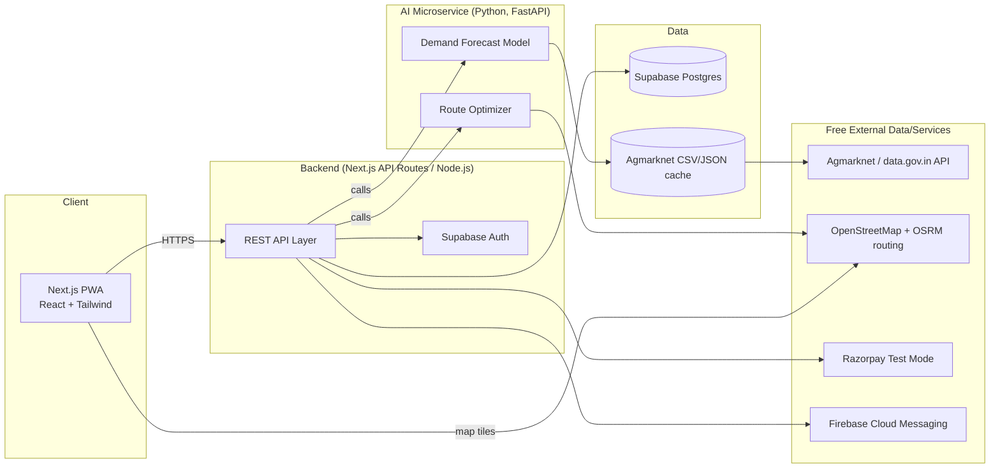

# 03 — Technical Architecture & Free Tech Stack

**Hard constraint honored throughout: every service below has a $0 tier sufficient for a hackathon build + small pilot. No credit card required to start (Razorpay Test Mode is the only exception and it never charges real money).**

## 1. Architecture Diagram



## 2. Layer-by-Layer Tech Stack (all free tier)

| Layer | Technology | Free tier detail |
|---|---|---|
| Frontend | **Next.js (React) + TypeScript + Tailwind CSS** | Open source, free |
| Hosting (frontend) | **Vercel** (Hobby plan) | Free, no cold start, auto HTTPS |
| Backend API | **Next.js API routes** (or separate Node/Express if team prefers split repos) | Same repo = simpler for a hackathon |
| Hosting (backend, if split) | **Render.com free web service** or **Railway free tier** | Free (may cold-start after 15 min idle — pre-warm before demo) |
| AI microservice | **Python + FastAPI** (forecasting + route optimization) | Hosted free on Render/HuggingFace Spaces |
| Forecasting model | **statsmodels / Prophet / scikit-learn** (linear regression / moving average) on Agmarknet data | Open source |
| Route optimization | **OR-Tools (Google, open source)** or simple nearest-neighbor heuristic, road distances via **OSRM public demo server** | Free, no API key |
| Maps / geocoding | **Leaflet.js + OpenStreetMap tiles**, **Nominatim** (OSM) for geocoding | Free, no API key required |
| Database | **Supabase (Postgres)** | Free tier: 500MB DB, 1GB file storage, 50k monthly active users |
| Auth | **Supabase Auth** (phone OTP or email) | Free tier included |
| File/image storage | **Supabase Storage** | Free tier included |
| Real-time price data | **Agmarknet API (data.gov.in)** | Free, official government open data |
| Notifications | **Firebase Cloud Messaging (push)** | Free, unlimited |
| Payments (demo) | **Razorpay Test Mode** | Free, simulates full checkout, no real money |
| i18n | **next-intl / react-i18next** with EN + HI JSON files | Free, open source |
| Version control / CI | **GitHub + GitHub Actions** | Free for public/small private repos |
| Design | **Figma (free tier)** for wireframes if needed | Free |

## 3. Why this stack (defend to jury in one sentence each)
- **Next.js single repo**: frontend + backend in one deployable unit — fastest to build and demo in hackathon time.
- **Supabase**: gives Postgres + Auth + Storage + Realtime in one free product, avoids stitching 3 separate paid services together.
- **Agmarknet**: the *only* credible, free, official real-time mandi price source in India — makes our "AI-suggested price" defensible and government-aligned (bonus: it's a DoCA-adjacent ministry data source, which is on-theme for this PS).
- **OSM/OSRM over Google Maps**: Google Maps Platform is NOT free past a small monthly credit and requires a billing account; OSM/OSRM/Nominatim require zero billing setup, critical for "everything should be free."
- **Python FastAPI microservice for AI**: keeps model code separate/swappable from the main app; can be upgraded later without touching the core marketplace.

## 4. AI Component Detail

### 4.1 Demand Forecasting Service
- **Input:** crop name, region (district/mandi), lookback window (default 30 days) — pulled from Agmarknet's daily arrivals + modal price dataset.
- **Model (MVP):** simple weighted moving average + linear trend regression (fast, explainable, no GPU needed). Upgrade path: Facebook Prophet for seasonality.
- **Output:** 7-day forecast array `{date, predicted_price, predicted_arrivals}` + one-line natural-language summary generated via a small template (no LLM call required — keeps it free and deterministic; an optional free-tier LLM call, e.g. Gemini API free tier, can prettify the sentence if available at demo time).
- **Also powers:** the "AI-suggested price" shown to farmers at listing time (same underlying data, just today's value instead of a 7-day array).

### 4.2 Route Optimization Service
- **Input:** list of confirmed order pickup points (farms) and drop points (buyers), each with lat/lng (geocoded via Nominatim from pincode/address).
- **Algorithm (MVP):** nearest-neighbor construction heuristic + 2-opt improvement (classic, fast, no paid solver needed) OR Google OR-Tools' free VRP solver if time permits.
- **Distances:** real road distances/times fetched from the **public OSRM demo server** (`router.project-osrm.org`) — free, no key. Fallback: Haversine straight-line distance if OSRM is unreachable.
- **Output:** ordered stop sequence, total distance, total estimated time — rendered as a polyline on the Leaflet map.

## 5. Deployment Topology for Demo Day

```
Vercel (Next.js app)  ──HTTPS──▶  Render (FastAPI AI service)
        │                                  │
        ▼                                  ▼
   Supabase (Postgres+Auth+Storage)   Agmarknet API / cached CSV
```
- Pre-seed the Supabase DB with ~30–50 demo listings, 3 farmer accounts, 3 consumer accounts, 1 bulk buyer, 1 admin — so the demo never depends on live network calls succeeding.
- Keep a `USE_LIVE_AGMARKNET=false` env flag that switches to a bundled cached JSON snapshot — flip to `true` only if the live API is confirmed working right before judging.
