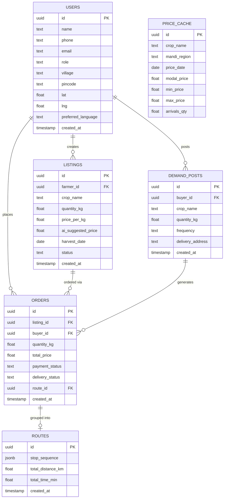

# 04 — Database Schema (Postgres / Supabase)

## 1. Entity-Relationship Overview



## 2. Table Definitions (SQL — ready to paste into Supabase SQL editor)

```sql
-- USERS
create table users (
  id uuid primary key default gen_random_uuid(),
  name text not null,
  phone text unique not null,
  email text,
  role text not null check (role in ('farmer','consumer','bulk_buyer','admin')),
  village text,
  pincode text,
  lat double precision,
  lng double precision,
  preferred_language text default 'en' check (preferred_language in ('en','hi')),
  created_at timestamptz default now()
);

-- LISTINGS
create table listings (
  id uuid primary key default gen_random_uuid(),
  farmer_id uuid references users(id) not null,
  crop_name text not null,
  quantity_kg numeric not null check (quantity_kg > 0),
  price_per_kg numeric not null check (price_per_kg > 0),
  ai_suggested_price numeric,
  harvest_date date,
  status text default 'active' check (status in ('active','sold_out','expired','removed')),
  created_at timestamptz default now()
);

-- DEMAND_POSTS (bulk buyer recurring demand)
create table demand_posts (
  id uuid primary key default gen_random_uuid(),
  buyer_id uuid references users(id) not null,
  crop_name text not null,
  quantity_kg numeric not null,
  frequency text check (frequency in ('one_time','weekly','biweekly','monthly')),
  delivery_address text,
  created_at timestamptz default now()
);

-- ROUTES (AI-optimized delivery batches)
create table routes (
  id uuid primary key default gen_random_uuid(),
  stop_sequence jsonb not null,          -- ordered array of {order_id, lat, lng, type: pickup|drop, eta}
  total_distance_km numeric,
  total_time_min numeric,
  created_at timestamptz default now()
);

-- ORDERS
create table orders (
  id uuid primary key default gen_random_uuid(),
  listing_id uuid references listings(id) not null,
  buyer_id uuid references users(id) not null,
  demand_post_id uuid references demand_posts(id),
  quantity_kg numeric not null check (quantity_kg > 0),
  total_price numeric not null,
  payment_status text default 'pending' check (payment_status in ('pending','test_paid','failed','refunded')),
  delivery_status text default 'placed' check (delivery_status in ('placed','confirmed','routed','out_for_delivery','delivered','cancelled')),
  route_id uuid references routes(id),
  created_at timestamptz default now()
);

-- PRICE_CACHE (Agmarknet snapshot, refreshed daily via cron/scheduled function)
create table price_cache (
  id uuid primary key default gen_random_uuid(),
  crop_name text not null,
  mandi_region text not null,
  price_date date not null,
  modal_price numeric,
  min_price numeric,
  max_price numeric,
  arrivals_qty numeric,
  unique(crop_name, mandi_region, price_date)
);

-- Helpful indexes
create index idx_listings_crop_region on listings (crop_name, farmer_id);
create index idx_price_cache_lookup on price_cache (crop_name, mandi_region, price_date desc);
create index idx_orders_buyer on orders (buyer_id);
create index idx_orders_listing on orders (listing_id);
```

## 3. Row-Level Security (RLS) Notes for Supabase
- `users`: a user can read/update only their own row; `admin` role can read all (via a Postgres policy checking `role = 'admin'`).
- `listings`: any authenticated user can `select` active listings; only the owning `farmer_id` can `insert/update/delete` their own listings.
- `orders`: `buyer_id` or the farmer who owns the related listing can view; only the buyer can create.
- `price_cache`: read-only for all authenticated users; writes only via the service-role key (used by the scheduled Agmarknet sync job).
